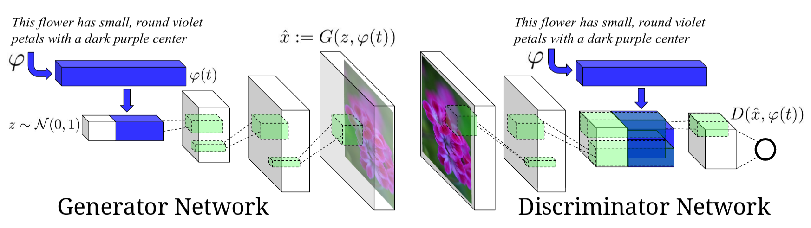
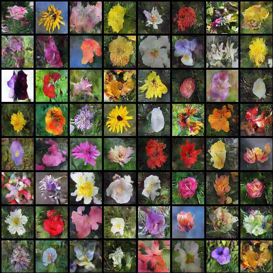

# Text-to-Image-Synthesis 

## Intoduction

This is a pytorch implementation of [Generative Adversarial Text-to-Image Synthesis paper](https://arxiv.org/abs/1605.05396), we train a conditional generative adversarial network, conditioned on text descriptions, to generate images that correspond to the description. The network architecture is shown below (Image from [1]). This architecture is based on DCGAN.

<figure></figure>
Image credits [1]

## Requirements

- pytorch 
- visdom
- h5py
- PIL
- numpy

This implementation currently only support running with GPUs.

## Implementation details

This implementation follows the Generative Adversarial Text-to-Image Synthesis paper [1], however it works more on training stablization and preventing mode collapses by implementing:
- Feature matching [2]
- One sided label smoothing [2]
- minibatch discrimination [2] (implemented but not used)
- WGAN [3]
- WGAN-GP [4] (implemented but not used)

## Datasets

We used [Caltech-UCSD Birds 200](http://www.vision.caltech.edu/visipedia/CUB-200.html) and [Flowers](http://www.robots.ox.ac.uk/~vgg/data/flowers/102/) datasets, we converted each dataset (images, text embeddings) to hd5 format. 

We used the [text embeddings](https://github.com/reedscot/icml2016) provided by the paper authors

**To use this code you can either:**

- Use the converted hd5 datasets,  [birds](https://drive.google.com/open?id=1mNhn6MYpBb-JwE86GC1kk0VJsYj-Pn5j), [flowers](https://drive.google.com/open?id=1EgnaTrlHGaqK5CCgHKLclZMT_AMSTyh8)
- Convert the data youself
  1. download the dataset as described [here](https://github.com/reedscot/cvpr2016)
  2. Add the paths to the dataset to `config.yaml` file.
  3. Use [convert_cub_to_hd5_script](convert_cub_to_hd5_script.py) or [convert_flowers_to_hd5_script](convert_flowers_to_hd5_script.py) script to convert the dataset.
  
**Hd5 file taxonomy**
`
 - split (train | valid | test )
    - example_name
      - 'name'
      - 'img'
      - 'embeddings'
      - 'class'
      - 'txt'
      
## Usage
### Training

`python runtime.py

**Arguments:**
- `type` : GAN archiecture to use `(gan | wgan | vanilla_gan | vanilla_wgan)`. default = `gan`. Vanilla mean not conditional
- `dataset`: Dataset to use `(birds | flowers)`. default = `flowers`
- `split` : An integer indicating which split to use `(0 : train | 1: valid | 2: test)`. default = `0`
- `lr` : The learning rate. default = `0.0002`
- `diter` :  Only for WGAN, number of iteration for discriminator for each iteration of the generator. default = `5`
- `vis_screen` : The visdom env name for visualization. default = `gan`
- `save_path` : Path for saving the models.
- `l1_coef` : L1 loss coefficient in the generator loss fucntion for gan and vanilla_gan. default=`50`
- `l2_coef` : Feature matching coefficient in the generator loss fucntion for gan and vanilla_gan. default=`100`
- `pre_trained_disc` : Discriminator pre-tranined model path used for intializing training.
- `pre_trained_gen` Generator pre-tranined model path used for intializing training.
- `batch_size`: Batch size. default= `64`
- `num_workers`: Number of dataloader workers used for fetching data. default = `8`
- `epochs` : Number of training epochs. default=`200`
- `cls`: Boolean flag to whether train with cls algorithms or not. default=`False`

## Results

### Generated Images

## Text to image synthesis
| Text        | Generated Images  |
| ------------- | -----:|
| A blood colored pistil collects together with a group of long yellow stamens around the outside        |   |
| The petals of the flower are narrow and extremely pointy, and consist of shades of yellow, blue      |   |
| This pale peach flower has a double row of long thin petals with a large brown center and coarse loo |  |
| The flower is pink with petals that are soft, and separately arranged around the stamens that has pi |  |
| A one petal flower that is white with a cluster of yellow anther filaments in the center |  |

## References
[1]  Generative Adversarial Text-to-Image Synthesis https://arxiv.org/abs/1605.05396

[2]  Improved Techniques for Training GANs https://arxiv.org/abs/1606.03498

[3]  Wasserstein GAN https://arxiv.org/abs/1701.07875

[4] Improved Training of Wasserstein GANs https://arxiv.org/pdf/1704.00028.pdf

## Other Implementations

1. https://github.com/reedscot/icml2016 (the authors version)
2. https://github.com/paarthneekhara/text-to-image (tensorflow)
